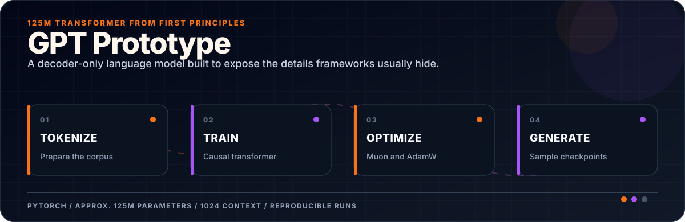
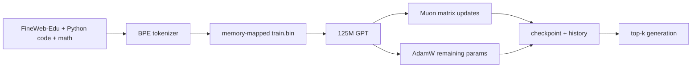
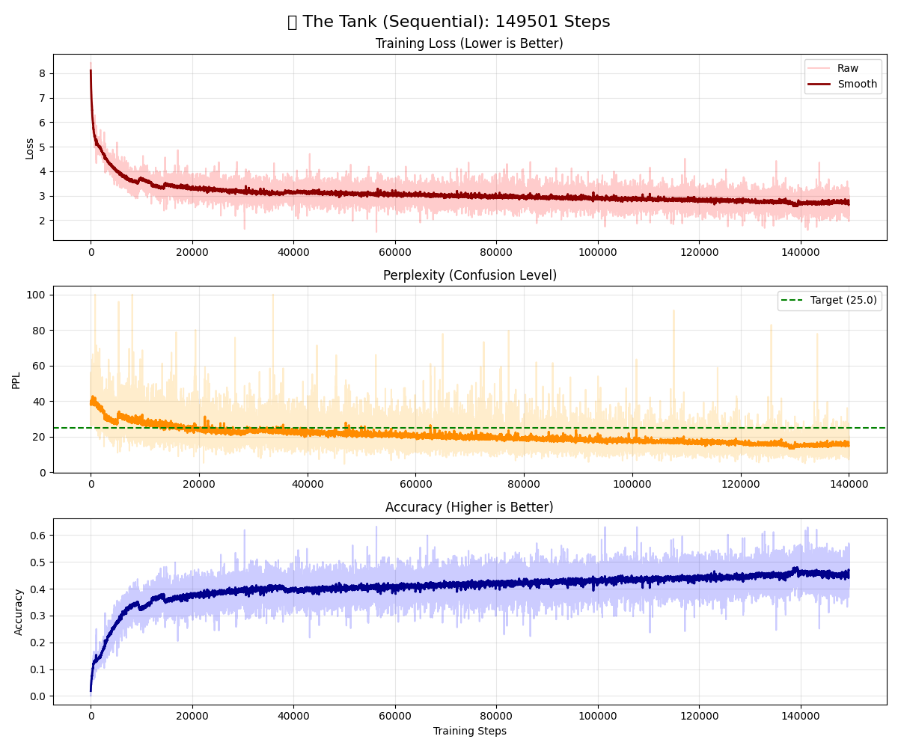
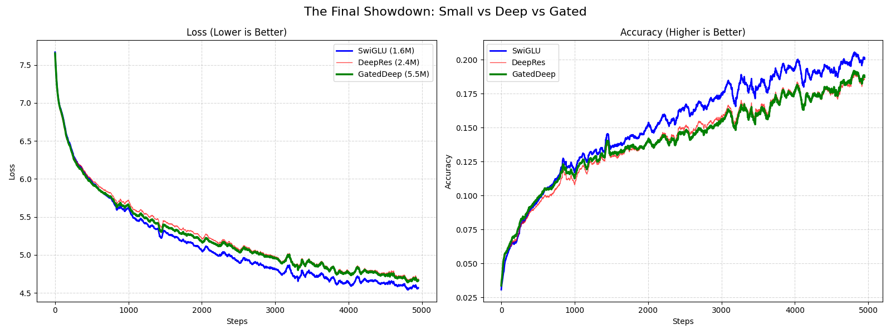

<div align="center">



</div>

[](./model.py)
[](./model.py)
[](./model.py)
[](./train.py)

**A decoder-only language model implemented to study the details that disappear behind high-level training frameworks.**

The repository contains the transformer, tokenizer/data preparation, memory-mapped training loop, hybrid optimizer split, checkpointing, generation, and experiment visualizations.

## Model card

| Component | Configuration |
|---|---|
| Architecture | Decoder-only causal transformer |
| Width / depth | 768 hidden size · 12 layers · 12 heads |
| Context | 1,024 tokens |
| Tokenizer | 4,096-token BPE configuration |
| Position | Rotary positional embeddings (RoPE) |
| Normalization | RMSNorm plus QK normalization |
| Feed-forward | Gated SiLU / SwiGLU-style MLP |
| Attention | PyTorch scaled dot-product causal attention |
| Stability | Zero-initialized attention output projection and logit soft-capping |
| Optimization | Muon for eligible 2D matrices; AdamW for embeddings, norms, and output head |

## Data and training path



The data scripts stream a 50/30/20 text/code/math mixture from Hugging Face datasets. Review each dataset’s license and access conditions before running them.

## Reproduce the pipeline

```bash
git clone https://github.com/ReaperXD67/GPT-Prototype.git
cd GPT-Prototype
python -m venv .venv
pip install -r requirements.txt

python train_tokenizer.py
python prepare_mixed_data.py
python train.py
```

Generation expects the tokenizer artifacts and a compatible checkpoint path configured in `generate.py`.

## Experiment artifacts

| Training status | Phase comparison |
|---|---|
|  |  |

## Reproducibility notes

- Training defaults are tuned for a memory-constrained laptop (`batch_size=1`), not throughput records.
- Large datasets and checkpoints are intentionally not committed.
- Report parameter count from `model.get_num_params()` for the exact tokenizer/configuration used.
- The included images are experiment artifacts; they are not independent benchmark results.
